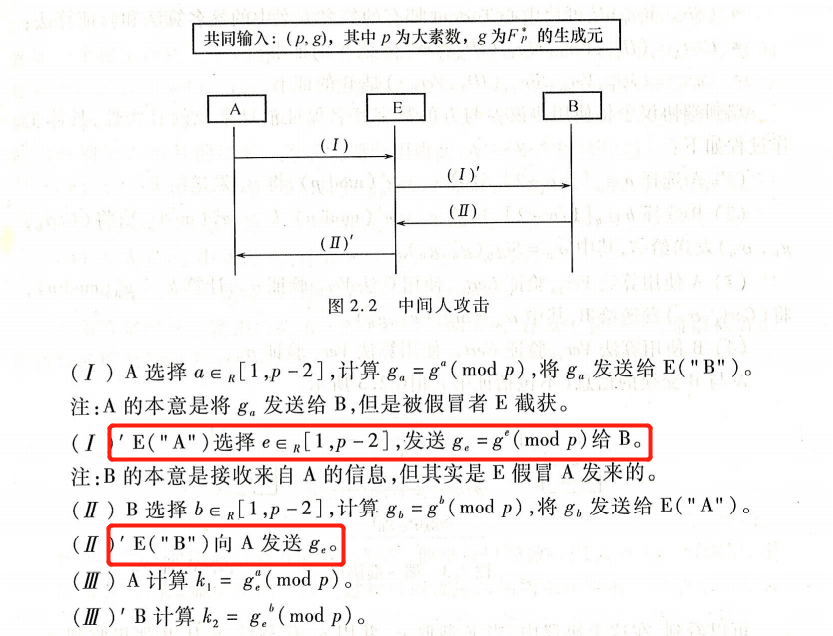
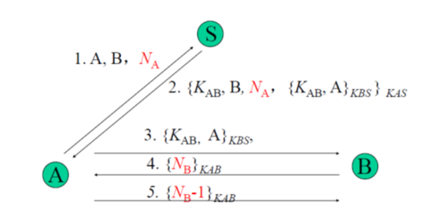
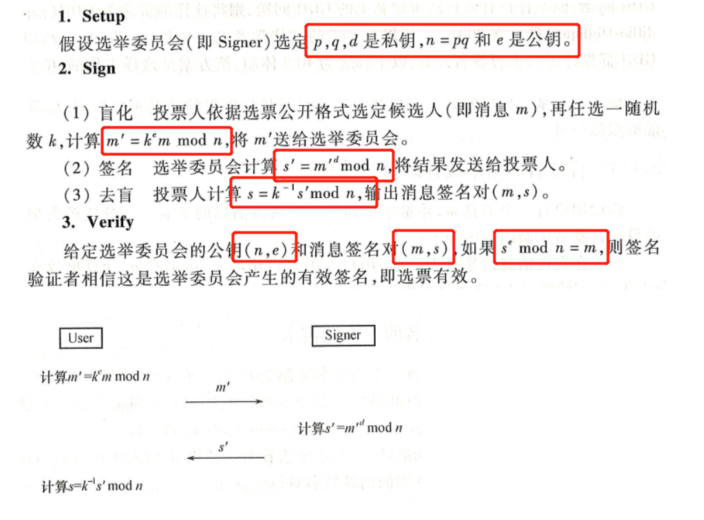

## 思考题

## Part1 密码学

###### 1.被动攻击者可以采取哪些攻击，主动攻击者呢？

* 被动攻击者可以窃听；
* 主动攻击者可以窃听、修改通信内容、增加或删除通信内容

###### 2.针对加密算法进行破解是否是Dolev-Yao模型中包含的攻击者的能力？针对数字签名进行伪造呢？

* 不是，Dolev-Yao模型中认为攻击者无法破解密码算法，仅攻击协议
* 可以针对数字签名的伪造

###### 3.A和B随机地从52张扑克中各抽岀一张扑克比较大小，由TTP发牌，只对牌进行签名，但如果不对牌面数字进行加密，可能遭遇什么攻击？

* 可能遭遇窃听、重放攻击

###### 4.如果由A对52张牌进行加密，在协议的设计中，为什么由B为A选一张牌？此外A对52张牌加密，是必须使用非对称密码体制吗？

* 必须，加密算法需要具有可交换性
* （此题有歧义，在这里认为对称加密体制是不可交换的）

 

###### 5.对称密码体制和非对称密码体制，哪种适合加密大量数据存储到云服务器上？

* 对称加密体制

###### 6.DES是一个分组加密算法,它的密钥长度是 <u>64_</u>位，去除奇偶校验位后为 <u>56</u> 位.

* 64位，出去校验位后为56位

###### 7.DES算法是____，密钥是 A.公开的  B.保密的

* 算法是公开的
* 密钥是保密的

 

###### 8.DES算法使用的S盒代换实质是？

* 查表操作

###### 9.简述RSA加密算法（密钥生成、加密算法、解密算法）

* 密钥生成：取大素数p，q；计算n=p*q，f = f(n)=(p-1)\*(q-1)，取与pq互质的大整数e，加法循环群内e对n的模逆为d，则：(n，e)为公钥，(n，d)为私钥
* 加密算法：c = m^e mod n
* 解密算法：m = c^d mod n

###### 10.简述ElGamal加密算法 （加密算法和解密算法）

* 密钥生成：大素数p，乘法生成元g，随机数x，计算 y = g^x mod p；公钥为 (y,g,p)，私钥为x
* 加密算法：选一随机数k，得到密文对 (c1, c2)：c1 = g^k mod p，c2 = m\*y^k mod p
* 解密： c2\*c1^(-x) mod p = m\*y^k \* (g\^k)\^(-x) mod p =m

 

###### 11.以下算法，哪种或哪些可以使得多次加密同一个明文而产生的密文不同

* ElGamal算法，选取了随机数k

---

## Part2 密钥交换

###### 1.公钥基础设施中，Alice的数字证书中的签名是由Bob生成，数字证书中包含的是Alice的公钥还是Bob的公钥？

* Alice

###### 2.若Alice的证书是根证书，是由哪个实体为Alice签发证书？

* Alice自己，根正数由自己签发

###### 3.简述DH协议和其遭受的中间人攻击

###### 4.简述隐式认证、密钥确认和显式认证的概念

* 隐式认证：协议参与的一方要确信只有**身份确定**的协议参与另一方才能知道共享密钥。
* 密钥确认：协议参与的一方要**确认**另一方已经拥有了共享的密钥。
* 显式认证：同时提供隐式密钥认证和密钥确认性。

###### 5.试介绍2种常用的避免重放攻击的技术措施

* 时戳
* 询问-应答（随机数）

###### 6.密钥建立协议所生成的密钥用作非对称加密算法还是对称加密算法？

* 对称加密算法

###### 7.试介绍非对称加密算法和对称加密算法的优缺点

|      | 对称密码               | 非对称密码                                                   |
| ---- | ---------------------- | ------------------------------------------------------------ |
| 优点 | 算法简单，加解密速度快 | 能公开加密密钥，仅需保存解密密钥，不存在密钥管理问题；还能用于消息认证 |
| 缺点 | 不便于密钥管理         | 算法复杂，加解密速度慢                                       |

###### 8.试介绍如下协议遭受的攻击

* 容易遭受**重放攻击**
* 假设攻击者E记录了A与B以前的会话，从而拥有一个旧的密文 SE(K', A)，并且知道K‘的值（由于随意丢弃会话密钥导致），然后完全阻塞AB的通信信道，并**重放**旧的密文数据 **SE(K', A)**，对B**伪装成A**，与B建立加密通信
* 具体攻击流程如下：

###### 9.哪种密码学技术既可以用于实现非否认性又可以实现数据完整性确认？

* 数字签名技术

###### 10.下述协议遭受什么攻击，具体攻击流程是？

* 易遭到**类型攻击**
* 攻击者E将第一步中截获的 {NA, M, A, B}KAS，在第四步中伪装成B发送给A，与A建立加密通信
* 由于消息类型相同，此时与A建立的 KAB 即为第一步中截获的 M||A||B的值

---

## Part3 群签名  / 环签名 初步

###### 1.群签名的应用场景

* 重要军事情报的签发，重要领导人的选举，电子商务重要新闻的发布等

###### 2.环签名的应用场景

* 匿名检举、以太坊使用环签名混币服务等

###### 3.动态群签名的概念

* 当一个群成员加入和撤销时，如果不需要更新群公钥或群成员的私钥，这样的群签名体制称为动态群签名

---

## Part4 高级签名协议

###### 1.简述基于RSA问题的盲签名算法 Setup, Sign, Verify

###### 2.盲签名的签名生成者是否匿名？

* 不匿名

###### 3.简述部分盲签名和一般盲签名在功能和算法上有何差别？

|      | 部分盲签名                     | 一般盲签名               |
| ---- | ------------------------------ | ------------------------ |
| 功能 | 可防止非法使用                 | 不可防止非法使用         |
| 算法 | 签名人嵌入事先约定好的公共信息 | 签名人完全不知道签名内容 |

###### 4.简述群签名和环签名实现匿名性的共同点和差别，另从是否具有可追踪性，是否具有群管理者方面阐述二者差别？

|                                | 群签名                   | 环签名               |
| ------------------------------ | ------------------------ | -------------------- |
| 实现匿名性：均使用了签名者私钥 | 可以使用群公钥、随机数等 | 必须使用其他人的公钥 |
| 可追踪性                       | 有                       | 无                   |
| 可链接性                       | 无                       | 有                   |
| 群管理                         | 有                       | 无                   |

###### 5.书中提到的简单群签名方案，由群管理者为一个用户生成多个公私钥对，每个公私钥对是否只能使用一次，如果只能使用一次，为了实现哪种安全性质？此外此方案存在哪些劣势？

* 是，为了实现无关联性；
* 劣势：
  * 密钥为一次性的，容易耗尽
  * 静态群签名，新成员加入时需要更新群公钥与成员私钥
  * 不具有防陷害性：管理员知道所有群成员的私钥，可以冒充任意群成员签名

###### 6.比特承诺具有哪些安全性质，可以应用在生活中哪些具体场景

* 安全性质：隐藏性、绑定性
* 应用场景：电子竞拍、公平的抛硬币协议