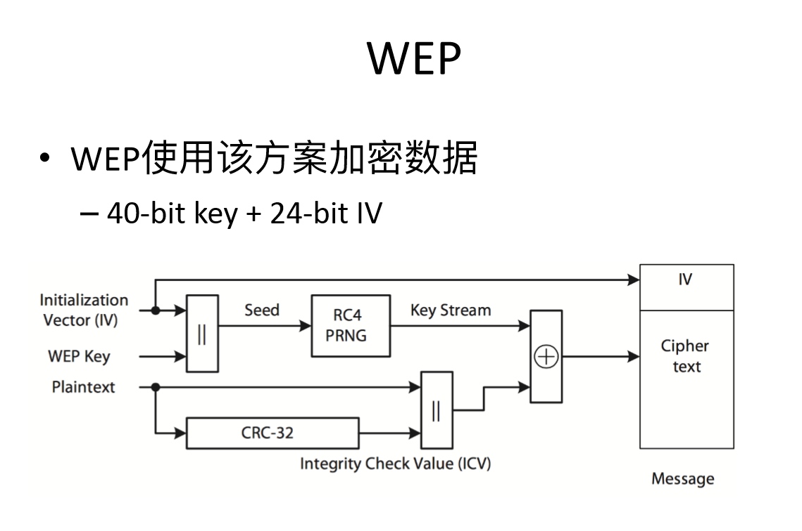

## WEP安全性分析

#### 1 WEP安全机制分析

$WEP$为对称加密，即加密密钥和解密密钥相同。为了保护数据，$WEP$使用$RC4$算法来加密从接入点发出的数据包。

$RC4$是同步流式加密算法，将一个短密钥扩展成一个任意长度的伪随机密钥流。发送端在用这个生成的伪随机密钥流与报文进行异或运算产生密文，接收端用相同的密钥产生相同的密钥流，再通过这个密钥流对密文进行异或运算得到明文报文。

#### 2 WEP隐患分析

###### 2.1 RC4算法隐患

在采用$IEEE802.11$协议的无线局域网络产品中，主要有两种方法来给定密钥$IV$的值。一种是当无线网卡在初始化时，$IV$的取值为$0$或某个随机数，然后按照数据包的个数主次按模$2^{24}$递增，增打到$2^24$时$IV$的值又回到$0$；另一种方法时在$[0,2^{24}-1]$中随机取$IV$值。

当采用第一种方法时，在传输大约$4823$个数据包后， 就会有 
$50％$的概率发生 $I V$碰撞 ， $1 24 30$个数据包后将有$ 9 9％$的 概率发生$ I V$碰撞。经过计算，在传输约$2^{12}$个数据包吼，将有$63\%$的概率发生碰撞。

在$WEP$协议中，每一个封装的数据包都包含一个初始向量$IV$.$IV$在数据帧中以明文的形式传输，并和原始密钥一起作为种子密钥，用来生成加密有效载荷的密钥流。但如果使用相同的$IV$加密两个消息，将导致两条消息的同时泄露：

设有两段明文$m_1,m_2$，他们采用相同的种子密钥$\{IV,Key\}$，对应生成的密文分别为$c_1,c_2$，则：

$c_1=m_1\oplus RC4\{IV,Key\}$

$c_2=m_2\oplus RC4\{IV,Key\}$

$c_1\oplus c_2=m_1\oplus m_2$

###### 2.2 密钥管理隐患

在$WEP$协议中，对密钥的生成和分布没有做任何规定，使用$WEP$加密密钥通常在很长一段时间不会改变。攻击者在一个密钥生存周期内可以获得大量的传输数据包，从中选择出使用相同$IV$的数据包，只要知道一个明文和密文，就可以计算出这些数据包使用的密钥。即$WEP$协议不足以抵御选择明文攻击。

###### 2.3 攻击时间分析

同时，在$WEP$数据帧中，第一个字节消息相同，攻击者可以得到第个字节的$G(k)$值，加上$IV$只有$24bits$，$2^{12}$个消息就很有可能出现碰撞（$63\%$的概率），利用碰撞，相对容易猜测出密文对应的明文。$2^{12}$虽为指数运算时间复杂度，但是由于指数过小，运算结果不大，整体运算过程仍可以在可接受的多项式时间内完成。

综上所述，以当今计算机的算力，$WEP$协议已不够安全。

